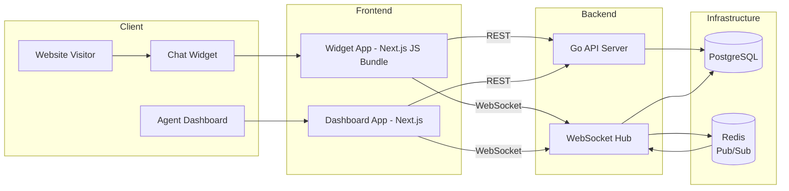

# Zendo – Development Plan

This document outlines the implementation plan, milestones, and technical decisions for building and evolving **Zendo**, a realtime live chat support platform.

---

## 1. Goals & Principles

### Primary Goals

- Provide a fast, reliable realtime chat experience for website visitors and support agents
- Keep the widget lightweight and easy to embed
- Enable multi-agent collaboration per website
- Ensure data integrity and conversation persistence
- Maintain a clean separation between widget, dashboard, and backend

### Engineering Principles

- Simple first, scalable by design
- Strong typing (Go + SQLC)
- Explicit ownership of data (website → agents → conversations)
- Realtime via WebSockets, async-ready for Redis
- Migrations and infra treated as first-class citizens

---

## 2. Core Domain Model

### Entities

- **Website**
  - Represents a customer’s website/project
  - Owns visitors, agents, conversations, messages
  - Authenticated via `api_key` for widget usage

- **Visitor**
  - Anonymous user identified via random token
  - Created on widget load
  - May have geo/IP metadata

- **Agent**
  - Authenticated dashboard user
  - Belongs to a website
  - Can be owner or invited agent

- **Conversation**
  - Session between a visitor and agents
  - Status: `open` / `closed`
  - Can be reassigned between agents

- **Message**
  - Belongs to a conversation
  - Sent by visitor or agent
  - Persisted and streamed in realtime

---

## 3. Backend Plan (Go)

### 3.1 API Architecture

- REST for:
  - Auth
  - Website management
  - Agent management
  - Conversation history
- WebSocket for:
  - Realtime messages
  - Typing indicators
  - Presence updates

### 3.2 Authentication

- Dashboard:
  - Email + password
  - JWT (access + refresh)
- Widget:
  - Website `api_key`
  - Visitor token stored in localStorage

### 3.3 WebSocket Design

- One WS endpoint:
  - `/ws?website_id=&visitor_id=&agent_id=`
- Message types:
  - `message:new`
  - `conversation:open`
  - `conversation:close`
  - `typing:start`
  - `typing:stop`
  - `agent:online`
  - `agent:offline`

### 3.4 Data Access

- PostgreSQL as source of truth
- SQLC for type-safe queries
- Transactions for:
  - Conversation creation
  - Agent assignment
  - Message insert + broadcast

### 3.5 Realtime Scaling (Phase 2)

- Redis Pub/Sub for:
  - Multi-instance WebSocket broadcasting
  - Presence synchronization
- Stateless API instances

---

## 4. Frontend Plan

### 4.1 Widget App

- Loaded via JS snippet
- Responsibilities:
  - Visitor identification
  - Conversation bootstrap
  - WebSocket connection
  - Message UI
- Constraints:
  - Minimal bundle size
  - No framework assumptions on host site

### 4.2 Dashboard App

- Agent login & onboarding
- Views:
  - Conversations list
  - Active chat view
  - Conversation history
- Features:
  - Realtime message updates
  - Typing indicators
  - Agent presence
  - Assign / close conversations

---

## 5. Database & Migrations

### Current Schema

- `websites`
- `visitors`
- `agents`
- `agent_invites`
- `conversations`
- `messages`

### Planned Enhancements

- Indexes:
  - `messages(conversation_id, created_at)`
  - `conversations(website_id, status)`
- Soft deletes (future)
- Audit fields for moderation (optional)

---

## 7. Security Considerations

- Hash passwords with bcrypt/argon2
- Validate website ownership for all agent actions
- Rate-limit widget message creation
- Sanitize message content
- Rotate API keys

---

## 8. Developer Experience

- Hot reload (Air + Next.js)
- Automatic migrations in dev
- Makefile as single entry point
- Clear separation of concerns
- Swagger for API discoverability

---

## 9. Open Questions / Future Decisions

- Should visitors be merged across sessions?
- Do we allow multiple websites per agent?
- Do we support file uploads?
- SLA / priority routing for conversations?

---

## 10. Success Criteria

- Widget loads in <100ms
- Messages delivered in <200ms RTT
- Zero message loss on refresh
- Easy onboarding for new agents
- Simple self-hosting story

## 11. Architecture Diagram

